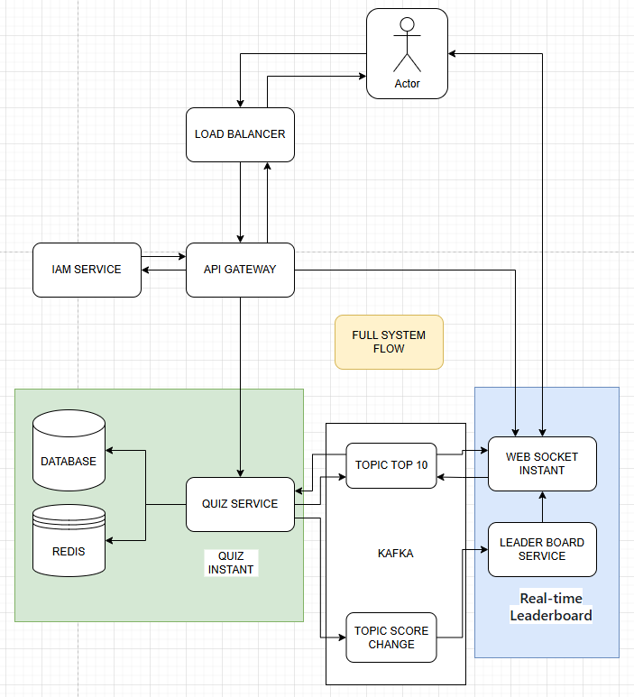
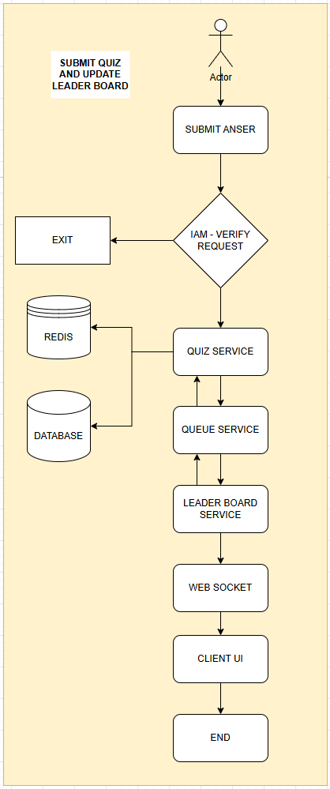

# Part 1: System Design
1. ## System Design Document:
    - ### Architecture Diagram:
        - 
        - 
    - ### Component Description:
      - **Load Balancer:** Used to distribute requests to the quiz service, especially when there are multiple instances of the quiz service as the application scales up.

      - **API Gateway:** In this case, it serves multiple purposes, including caching, routing, and acting as the central point for authorization.
        
      - **IAM Service:** Used to determine whether a user has permission to make a request through the gateway.
        
      - **Quiz Service:** This is where the main quiz logic is handled, including quizzes and questions.
        
      - **Kafka:** Ensures that all requests, after the score is calculated, are placed in a queue. Requests that come first are processed first. Additionally, Kafka facilitates communication between different services.
        
      - **Leaderboard Service:** This is where the leaderboard logic is processed before sending the data back to the user. It may update user information and handle leaderboard-specific calculations.
        
      - **WebSocket Service:** This is where the connection between the leaderboard service and the users is established. Data is updated and pushed directly to users through this channel.
      - ### Data Flow:
        - When a user logs in, a request is sent to the **Load Balancing Service**.
        - The **Load Balancing Service** ensures optimal performance by routing the request to the most available **API gateway**.
        - When the **API Gateway** receives the login request, it communicates with the **IAM Service** to authenticate the user and returns user data through the **Gateway Service** and Load **Balancer Service**.
        - Once the user is authenticated, they proceed to the Quiz Screen.
        - On the **Quiz Screen**, a request is made to retrieve the Quiz list from the **Quiz Service** through the **Load Balancer** and **API Gateway**.
        - At this point, the user can select a quiz from the displayed list.
        - When the user clicks on a quiz, they are directed to the quiz question screen. On this screen, the following actions take place:
          - A request is made to the **Quiz Service** through the **Load Balancer** and **API Gateway** to fetch the list of questions, which are then displayed on the screen.
          - A request is also made to the **Leaderboard Service** through the **Load Balancer** and **API Gateway**. The **Leaderboard Service** communicates with the **Quiz Service** through **Kafka** topic **TOP_10** to retrieve the top 10 highest-scoring users from **Redis**. This data is returned and displayed on the user interface.
          - At the same time, a connection is opened to the **WebSocket Service (WSS)** to ensure that the **Leaderboard Service** is continuously updated.
        - When the user answers a question, after they confirm their answer, a request containing their answer is sent to the **Quiz Service**.
        - The **Quiz Service** then calculates the user's score and simultaneously saves the data to both the **Database** and **Redis**. 
        - Afterward, a message is sent to the **SCORE_CHANGE** topic, notifying the **Leaderboard Service** to update the top 10 leaderboard.
        - At this point, the **Leaderboard Service** sends an event to **Kafka** and receives data from **Kafka**.
        - The **Leaderboard Service** then sends an event to the **WebSocket Service (WSS)**, which broadcasts the update to everyone participating in the same quiz, ensuring that the leaderboard is updated for all users in real-time.
        - ### Technologies and Tools:
          - I'm using **Docker** to initialize the project and create a demo.
          - **Redis** is used as a caching service. Most read requests are handled through Redis because it's an in-memory database, which makes it faster, and it also reduces stress on the database.
          - Load Balancer uses **Nginx** to route requests to the various services in case we need to scale.
          - API Gateway, IAM Service, Quiz Service, and Leaderboard Service are built with **Python FastAPI**, a lightweight framework that's easy to use since we don't require tasks related to UI.
          - **Kafka** is used as the message broker to handle communication between services. Since the application requires real-time communication, I'm opting not to use RabbitMQ.
          - **WebSocket** Service is used to establish connections and update data directly to users in real-time.
          - **Kafka UI** is used to manage queues, topics, and messages.
          - **Redis command** is used for an overall management of Redis.